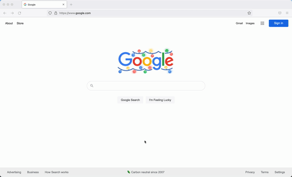
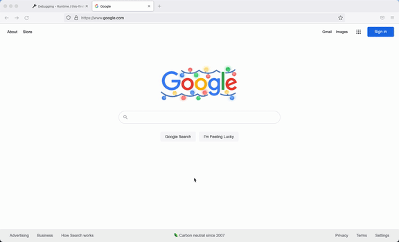

# Fuzzy Search for Coursera Video Subtitles

Presently, Coursera video subtitles search provides exact match only for queries. Due to the inaccuracies in subtitles, as well as the frequency of typos, there is a clear benefit to implementing approximate string matching, or fuzzy search. Fuzzy search will help ensure students do not miss out on important information.

# Browser Extension

### Requirements

- Firefox (Tested on v94.0.1)

### Installation Instructions

First, import the add-on:

1. In Firefox, go to about:debugging
2. Click "This Firefox"
3. Click "Load Temporary Add-On"
4. Navigate to your saved `manifest.json` file and click on it

### Using the Extension

1. Right-Click on any page in Firefox
2. Click "Fuzzy Search"
3. On the Fuzzy Search page, enter a query you'd like to search for

### Required JS files

- background.js: This script is required for the "Fuzzy search" context menu option
- tabs.js: This script is related to the Fuzzy Script page and sends queries/receives responses for the application logic

---

# Approximate String Matching Algorithm 

### Requirements 

- pip install nltk

### Inputs & Outputs

- input: corpus of subtitles, search query 
- output: matches (video name, timestamp, subtitle snippet)

### Implementation 

- stemming of query and documents (subtitles)
- removal of stop words from query 
- results returned in ranked order based on closeness of match

